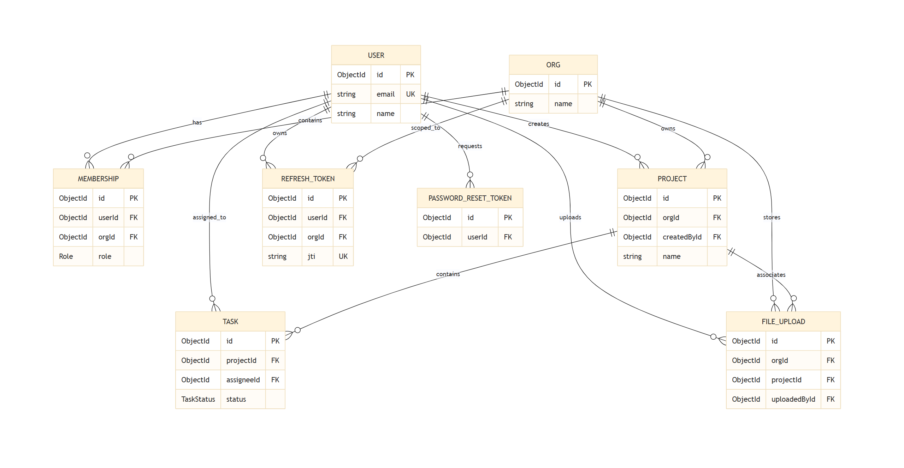

# SaaS Project Management API

This API provides multi-tenant orgs, projects, tasks, file uploads, and secure auth with rotating refresh tokens.

> This is just a side project to refine my backend skills. It's not production-ready and may have security issues. Use at your own risk.

## Setup

1. Copy `.env.example` to `.env` and fill in MongoDB Atlas and S3-compatible credentials.
2. Install dependencies:

```
npm install
```

3. Generate Prisma client and push schema:

```
npm run prisma:generate
npm run prisma:push
```

4. Start the API:

```
npm run dev
```

## Database Schema


